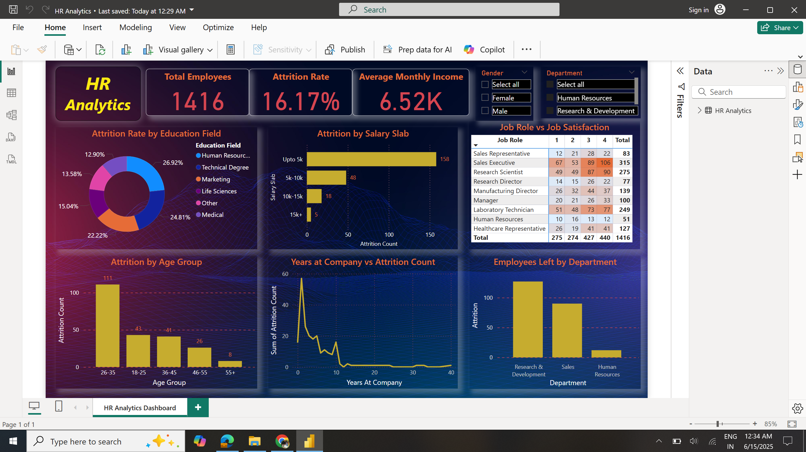

# 💼 HR Analytics Dashboard – Power BI Project

Welcome to my Power BI project on **HR Analytics**.  
This project is focused on understanding employee attrition patterns, workforce satisfaction, and salary trends through insightful data visualization and dashboarding.

---

## 📌 Objective

To build an interactive and insightful Power BI dashboard that enables HR teams to:

- Analyze employee attrition trends
- Understand job satisfaction by role and department
- Visualize salary distributions and workforce demographics
- Take data-driven HR decisions to reduce turnover

---

## 📷 Dashboard Preview

Example:  

---

## 📊 Dataset

- **📁 Dataset:** [Download HR_Analytics.csv](HR_Analytics.csv)
- **Rows:** ~1400 employee records  
- **Columns Include:**
  - Employee Demographics (Age, Gender, Marital Status)
  - Work Experience (Years at Company, Job Role)
  - Satisfaction Metrics (Job, Environment, Relationship)
  - Salary, Education, Travel, Attrition, etc.

---

## 🛠️ Tools & Skills Used

- Power BI Desktop
- DAX (for KPIs & Measures)
- Data Modeling
- Data Cleaning & Transformation
- Visualization Design
- Interactive Slicers and Filters

---

## ✅ Tasks Completed

### 🔹 Task 1: Data Preparation
- Imported HR data from Excel
- Renamed columns for readability (e.g., `Monthly_Income` → `Monthly Income`)
- Corrected data types (categorical vs numeric)
- Removed duplicates
- Handled nulls using context-aware techniques (e.g., mean imputation for `YearsWithCurrentManager`)

---

### 🔹 Task 2: KPI Creation
Created **KPI Cards** using DAX for:
- **Total Employees** = COUNT(EmployeeNumber)
- **Attrition Rate** = (Employees Left / Total Employees) × 100
- **Average Monthly Income** = AVERAGE(Monthly Income)

All KPIs are formatted with consistent style and placed at the top of the report for quick viewing.

---

### 🔹 Task 3: Dashboard Visualizations

| Visualization | Description |
|---------------|-------------|
| Donut Chart | Attrition Rate by Education Field |
| Clustered Column Chart | Attrition by Age Group |
| Bar Chart (Horizontal) | Attrition by Salary Slab |
| Matrix Visual | Job Role vs Job Satisfaction |
| Line Chart | Years at Company vs Attrition Count |
| Column Chart | Department vs Number of Employees Left |
| Slicers | Gender & Department filters |
| Title | Dashboard header using Text Box: **HR Analytics Dashboard** |

---

## 🔍 Key Insights

- Most attrition is seen in early career stages (Age 26–35)
- education fields (hr and technical) show higher attrition rate
- Monthly income and job satisfaction are major drivers of retention

---
